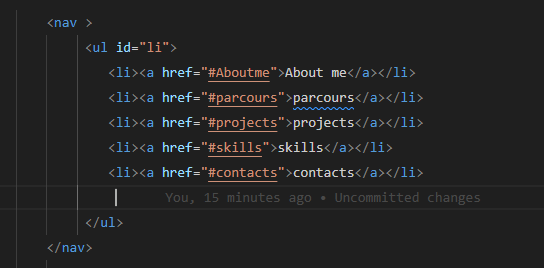
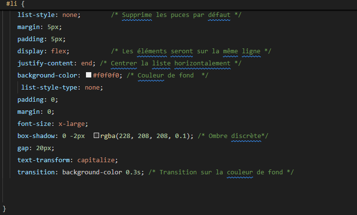
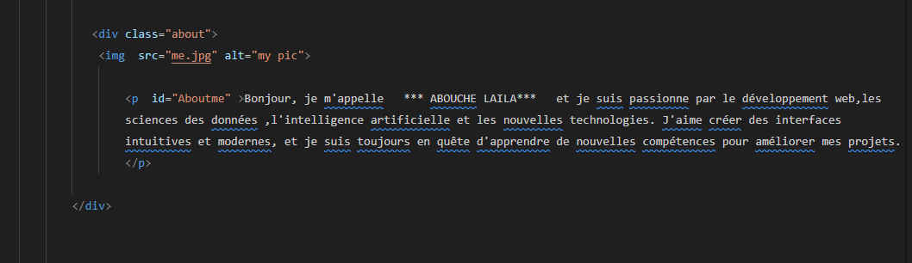
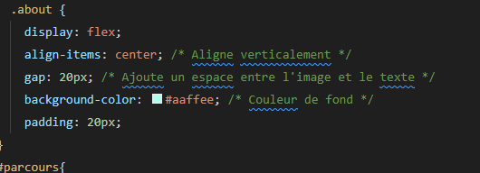
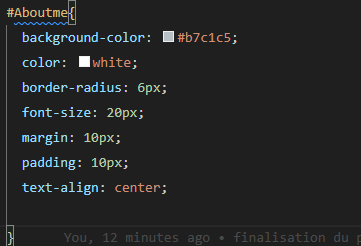

***Compte rendu du TP Portfolio fait en Html et en CSS***:

**Module:Technologies-Web-et-XML-Web-s-mantique**
 filière:SDIA(systèmes distribuées et intelligence artificielle).

 Remarque:
       le TP du portfolio est fait par moi-meme pour tout qui concerne HTML et CSS ,pour le code que j'ai pris par chatgpt est écrit avec un commentaire ,pourtant tout est mon code,meme le readme.

 ***1.la conception de la page du portfolio :***

      la page portfolio doit contenir tous les informations professioneeles et personnelles nécessaires pour le monde de travail.

      d'abord on fait les div nécessaires ,les paragraphes ,les listes ,l'architechture complète pour le portfolio après ,l'étape de CSS, c'est pour ajouter du style sur le code,que ca soit :les couleurs,les lignes,les backgrounds,les images avec un encadrement...

   ***1.1 le navbar***

   
   j'ai essayé de mettre tout les élements qui vont plus au moins controler le contenu du portfolio:
   Du coup ,j'ai mis pour chaque champ que ca soit about me,contacts... ,un lien interne pour cela a chaque fois l'utilisateur peut consuler efficacement.
   j'ai essayé de les mettre dans une liste non ordonnée et avec un id ,pour que je puisse différencier entre chaque liste,apparemment,il exste plusieurs liste non ordonnée,d'ailleurs les listes et surtout les listes non ordonnées sont lprmis les plus types de structures plus utilisés ensuit j'ai appliqué le style avec confort comme indiqué dans la capture suivante;
   
   pour le style j'ai essayé de faire les choses a simplicité,comme déja indiqué mon code est celui qui n'a pas de commentaires.

   ***About Me***
 
   
   ici ,j'ai creéé un div qui va contenir deux élements,le premier et le paragraphe ou je m'exprime,le deuxième est ma photo qui va charger un espace important de mon portfolio .
   j'ai mis les deux dans meme div pour que je puisee les controler a le style,qar je veux que les deux soiient placées l'un coté de l'autre hirizontalement comme indiqueé ici ,dans le style CSS;
   
   aussi ,pour styler deplus le paragraphe j'ai mis le suivant;
   
   

